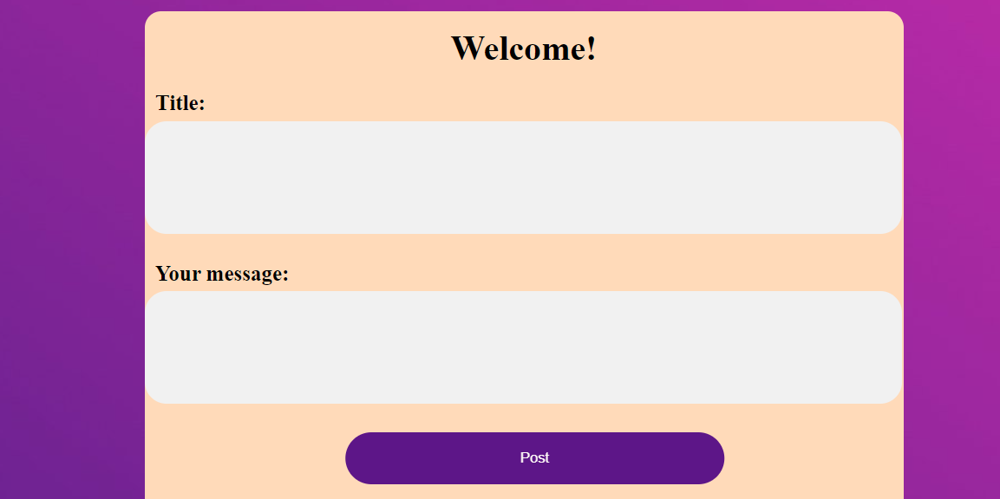
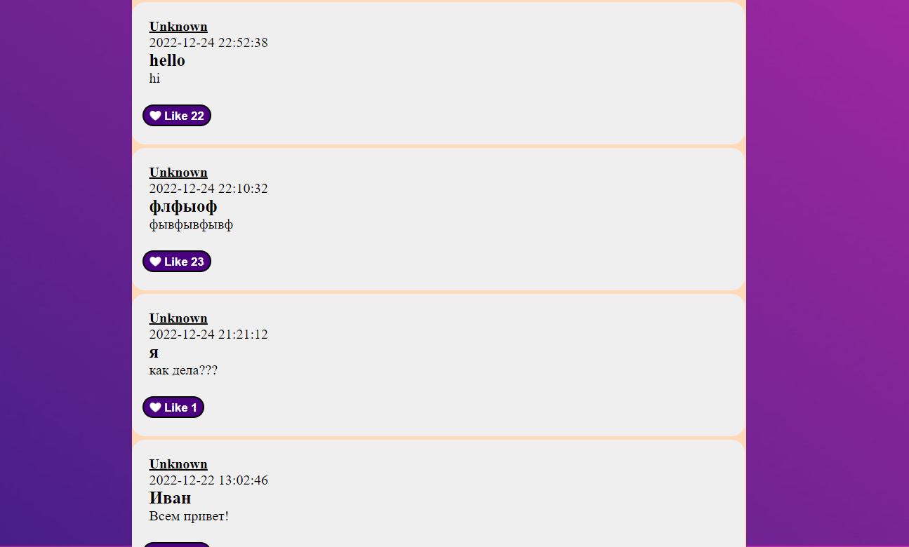
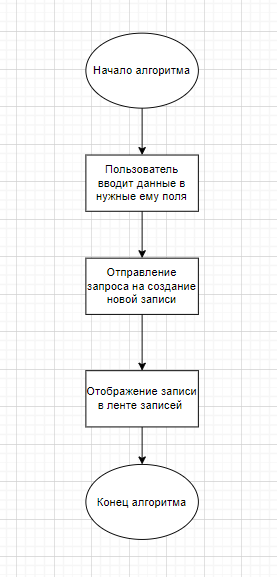
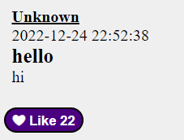

#Цель работы:
Разобрать и реализовать клиент-серверную информационную систему, реализующую механизм CRUD.
***
##Задание:
- Добавление текстовых заметок в общую ленту
- Реакция на чужие заметки(Лайки)
***
###Пользовательский интерфейс
1. Форма ввода комментариев

2. Комментарии

***
##Пользовательский сценарий работы
При входе на страницу, пользователь видит надпись Welcome и форму для ввода заметок.
***
##API сервера и хореография 
Сервер использует HTTP POST запросы с полями заголовка и текста заметки.
1. Функция добавления комментариев на сайт: с помощью POST запроса отправляются такие данные как, заголовок и текст заметки.

2. Функция вывода комментариев на сайте: из базы данных берётся только 100 последних комментариев (их дата добавления, заголовок и текст) и присваивает каждому имя пользователя "Аноним".
***
##Структура базы данных
- id (Уникальный идентификатор комментария): INT(11), AUTO_INCREMENT
- title (Заголовок): VARCHAR(1024), по умолчанию NULL
- message (Текст комментария): TEXT, NULL
- date (Дата и время создания записи): DATETIME, NULL
- likes (Количество лайков на комментарии): INT(11), NULL
***
##Алгоритмы
- Алгоритм создания комментария

Пользователь может ввести только заголовок и заметки. Так как стена заметок анонимная, то у всех пользователей автоматически добавляется имя: Unknown. Также каждой заметке присваивается дата и время, когда он был отправлен.
Еще пользователь может оценить заметку кнопкой с иконкой лайка. Нажимая на ее количество лайков увеличивается с каждым разом на 1 увеличивается.

***
##Программный код, реализующий систему
1. Реализация добавления заметки в БД
```
function setComments($conn) {
  
    if(isset($_POST['commentSubmit'])) {
      
        $date = $_POST['date'];
        $title = $_POST['title'];
        $message = $_POST['message'];
      

        $sql = "INSERT INTO 'com' ('date', 'title', 'message') VALUES ('$date', '$title', '$message')";
        $result = $conn->query($sql);
        unset($_POST['date']);
        unset($_POST['title']);
        unset($_POST['message']);
        
    }
}
```

2. Реализация вывода заметок 
```
function getComments($conn) {
    $sql = "SELECT DISTINCT* FROM com ORDER BY date DESC LIMIT 100";
    $result = $conn->query($sql);
    while ($row = $result->fetch_assoc()) {
        echo "<div class='comment'>
            <br>
            <div class='name'> Unknown </div>
            ".$row['date']."<br>
            <div class='title'> ".$row['title']."<br> </div>
            ".$row['message']."
            <table>
                <tr>
                    <td> <div><br><form method='POST' action='".likeSubmit($row)."'> <button type='submit' name='".$row['id']."' class='likebtn'>❤ Like ".$row["likes"]."</button></form></div> </td>

                </tr>
            </table>
            <br>
        </div>
        <br>";
    }
}

```
3. Реализация лайков
```
function likeSubmit($row) {    
    require("connection.php");
    if(isset($_POST[$row['id']])) {
        $id = $row['id'];
        $likes = $row['likes']+1;
        $query = "UPDATE comments SET likes = '$likes' WHERE id = '$id'";
        $result = mysqli_query($conn, $query);
        header('Location: main.php');
        exit;
    }
}

```